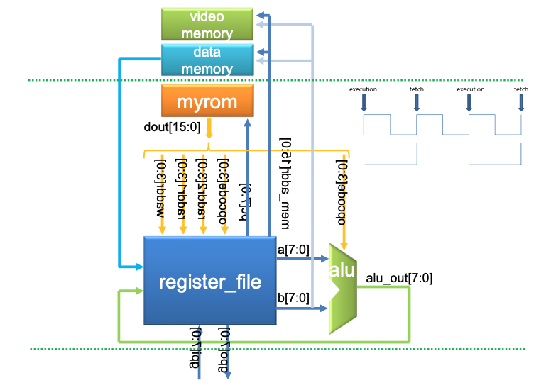
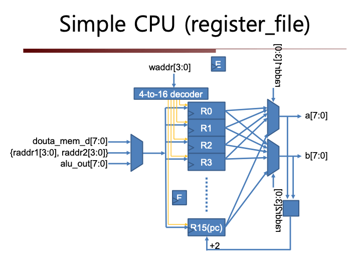
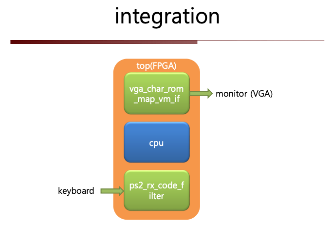

# HDL 기말 프로젝트 Simple Cpu
## 개발 환경
- modelsim (for simulation)
- Fpga
    - Board: Spartan-3AN Starter Kit
    - Software: Xilinx_ISE_13.3
## Architecture



- Component
    - CPU
    - Keyboard: ps2_rx module
    - VGA Controller
## Description
### 각자 설계한 CPU + VGA controller + keyboard 를 이용하여 다음과 같이 실습 시험을 치룸
- 실습 시험 당일 주어지는 2개의 8-bit unsigned number 를 임의 레지스터로 로딩하 고 모니터 화면에 하나씩 출력되도록 myrom 용 프로그램(기계어)를 수정해 .coe 파일로 저 장
- ISE 합성 후 configuration
- 키보드의 키(A: addition, X: xor, N: nand, R: shift right, L: shift left)를 랜덤하게 누를 때마다 그 number 들에 대해 연산을 수행해 그 결 과를 화면에 출력
    - addition 시 carry 는 무시할 것
    - shift 연산은 첫번째 숫자에만 적용
### myrom.coe 파일(기계어 프로그래밍)
프로젝트 중 가장 어려웠더 부분이 myrom을 모듈(.v파일)로서 구현하는게 아닌 순수 기계어(coe파일)로 작성해야 하는것이 난이도가 있었습니다.
각 모듈을 참고하며 프로그램의 흐름을 만든뒤 적절한 조건과 분기를 통해 기능을 구현하였습니다.
<br>
[myrom.coe](myrom.coe)
```
MEMORY_INITIALIZATION_RADIX=2;
MEMORY_INITIALIZATION_VECTOR=
1100010101010000  	
1100001110010001  	          
1100000011110101  	
1100000111000010  	
1100001000100011  	
1100001100010100  	
1100001011011000  	
1100010010111001 	
1000000000000110  	
1000011000000110  	
1000011000000110  	
1000011000000110  	
0100011001010110  	
0100000001010111 	
1100000000001101  	
1100000000001110  	
1110001001100000 	
1100000000001101  	
1100000000011110  	
1110001001110000 	
1000000100000110  	
1000011000000110  	
1000011000000110  	
1000011000000110  	
0100011001010110  	
0100000101010111  	
1100000000011101  	
1100000000001110  	
1110001001100000  	
1100000000011101  	
1100000000011110  	
1110001001110000  	
1111000000000010  	 
1100001000001111  	
1110100000000000  	
1111101100100001  	
1100001001101111  	
1100001100111111  	
1111101100110001  	  
1100001010011111  	 
1100010000101111  	 
1111101101000001  	 
1100001011001111  	 
1100010100011111  	    
1111101110000001  	 
1100001011111111  	 
1100011000001111  	   
1111101110010001  	 
1100001100101111  	 
1100011011111111  	  
1100001000001111  	 
0001000000011100   	
1110100000000000  	
1000110000000110  	
1000011000000110  	
1000011000000110  	
1000011000000110  	 
0100011001010110  	
0100110001010111  	
1100000000101101  	
1100000000001110  	
1110001001100000  	
1100000000101101  	
1100000000011110  	
1110001001110000 	
1100001000001111  	 
0110000000011100   	 
1110100000000000  	
1000110000000110  	
1000011000000110  	
1000011000000110  	 
1000011000000110  	
0100011001010110  	
0100110001010111  	
1100000000101101  	
1100000000001110  	
1110001001100000  	
1100000000101101  	
1100000000011110  	
1110001001110000  	
1100001000001111  	 
1011000000011100	
1110100000000000  	
1000110000000110  	
1000011000000110  	 
1000011000000110  	 
1000011000000110  	 
0100011001010110  	
0100110001010111  	
1100000000101101  	
1100000000001110  	
1110001001100000  	
1100000000101101  	
1100000000011110  	
1110001001110000  	
1100001000001111 	 
1000000000001100  	  
1110100000000000  	
1000110000000110  	 
1000011000000110  	 
1000011000000110  	 
1000011000000110  	 
0100011001010110  	
0100110001010111  	
1100000000101101  	
1100000000001110  	
1110001001100000  	
1100000000101101  	
1100000000011110  	
1110001001110000  	
1100001000001111	
1001000000001100  	
1110100000000000  	
1000110000000110  	
1000011000000110  	
1000011000000110  	
1000011000000110  	
0100011001010110  	
0100110001010111  	
1100000000101101  	
1100000000001110  	
1110001001100000  	
1100000000101101  	
1100000000011110  	
1110001001110000  	
1100001000001111;  	
```
<br>
[char_rom.coe](char_rom.coe)
```
MEMORY_INITIALIZATION_RADIX=16;
MEMORY_INITIALIZATION_VECTOR=
00, 3C, 62, 52, 4A, 46, 3C, 00,	
00, 08, 38, 08, 08, 08, 3C, 00,	
00, 18, 24, 04, 08, 10, 3C, 00,	
00, 00, 3C, 42, 0C, 42, 3C, 00,
00, 0C, 14, 24, 7E, 04, 04, 00,	
00, 7E, 40, 7C, 02, 42, 3C, 00,	
00, 3C, 40, 7C, 42, 42, 3C, 00,	
00, 3C, 24, 24, 04, 04, 04, 00,	
00, 3C, 42, 3C, 42, 42, 3C, 00,	
00, 3C, 42, 3E, 02, 42, 3C, 00,
00, 3C, 42, 7E, 42, 42, 42, 00,	
00, 7C, 42, 7C, 42, 42, 7E, 00,	
00, 7E, 40, 40, 40, 40, 7E, 00,	
00, 7C, 46, 42, 42, 46, 7C, 00, 	
00, 7E, 40, 7E, 40, 40, 7E, 00, 	 
00, 7E, 40, 7E, 40, 40, 40, 00;	
```